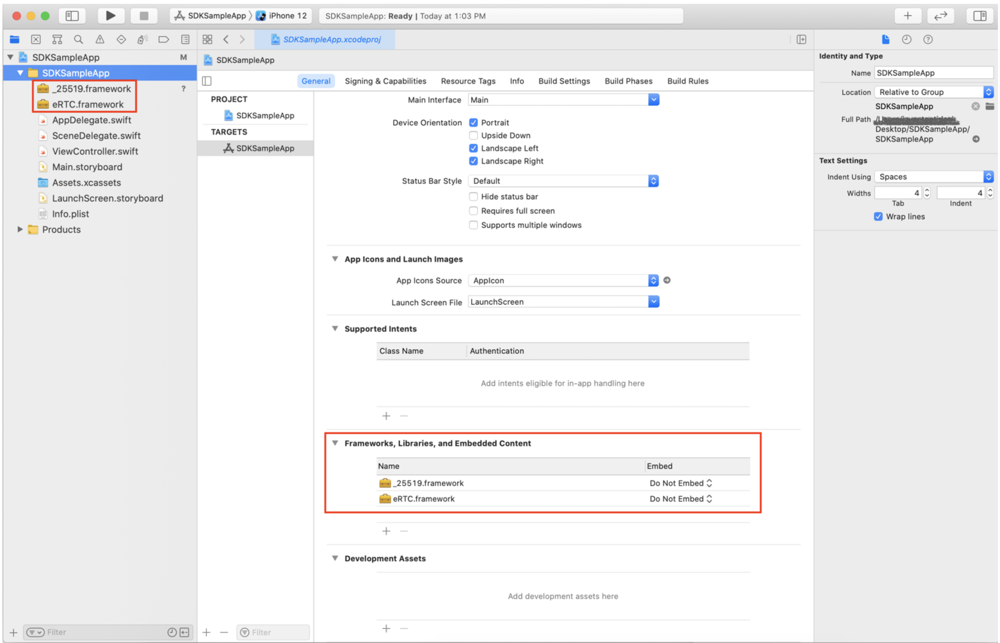
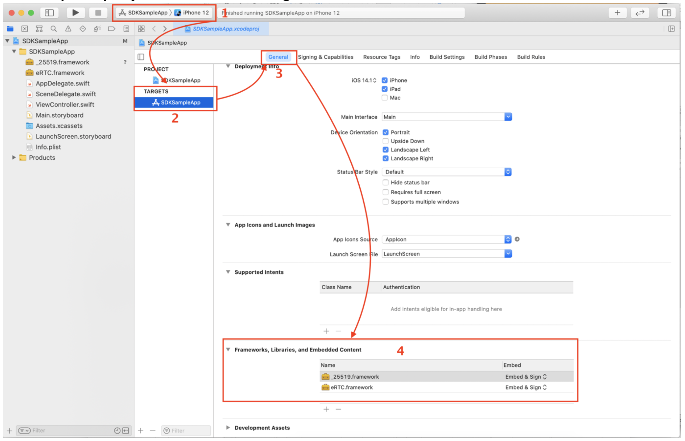
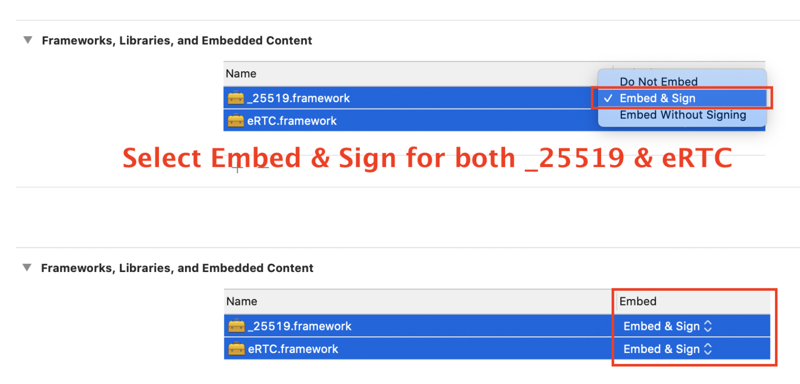
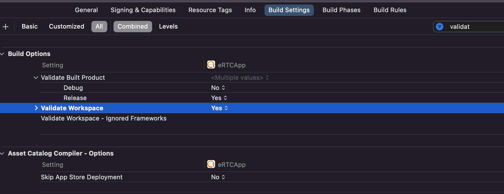
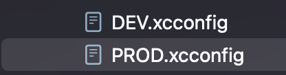
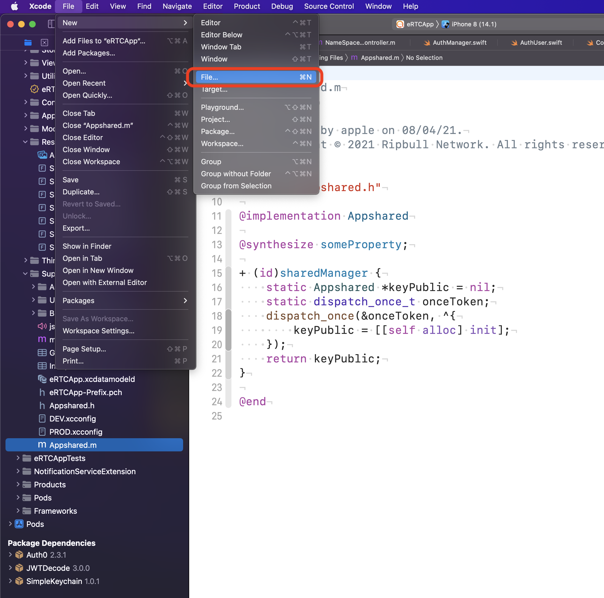
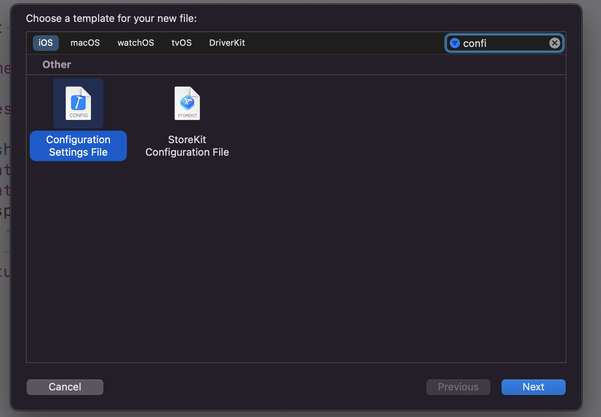
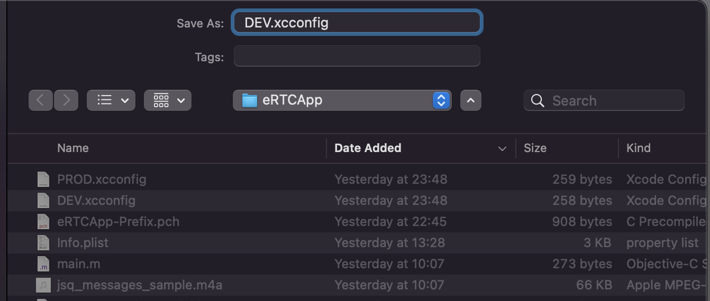
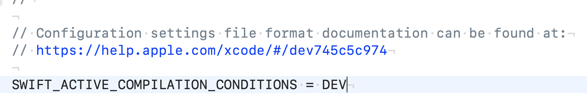
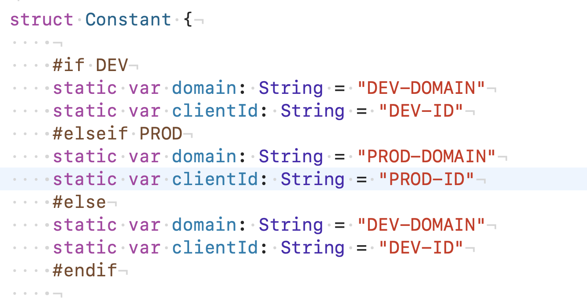

## Steps to integrate ChatSDK into a new project

### Prerequisite
- Require Universal-Framework.zip
- Xcode 12.1
- iOS project

### Integrate

1. Unzip Universal-Framework.zip

2. Open your project. Drag and drop the framework (**\_25519.framework** and
**eRTC.framework**) in to the project

3. now **_25519.framework** and **eRTC.framework** appears in the project workspace and the **Framework, Libraries, and Embedded Content**

Select your project **Schema > Targets > General tab**

Select Embed & Sign

4. In project's **Build Settings**, search the **Validate Workspace** and set to **Yes** (just in case you cannot build the project).

5. Make sure you have at least 2 config file for **DEV** and **PROD** environments

#### *How to create config file*:
- Select  **File > New > File**:

    

- Choose *Configuration Settings File* template:

    

    

- Set `SWIFT_ACTIVE_COMPILATION_CONDITIONS` for your evironments for later usage:

    

    Example:
    

6. To work with ChatSDK please follow documentation here: https://inappchat.io/documentation/ios
